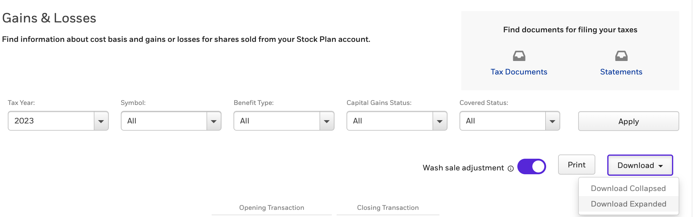
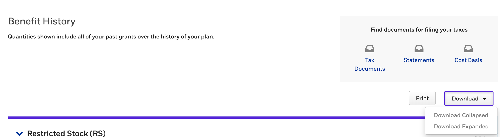

# E-trade extract
This is a python script that extracts data from E-trade exported files to help with the Swedish tax declaration.

## Installation

Installing and managing Python
Create a new virtual environment with for your supported Python version. Within that virtualenv:

`$ pip install -r requirements.txt
`

### Export
The transactions folder should contain Gains & Losses as well as Benefit History exported from E-trade

* [Export Gains & Losses:](https://us.etrade.com/etx/sp/stockplan#/myAccount/gainsLosses) Go to Work -> My account -> Gains & Losses -> click Download (expanded)
  * Do this for all tax years you're interested in. Or since the start of your current grants

* [Export Benefit History](https://us.etrade.com/etx/sp/stockplan#/myAccount/benefitHistory) Go to Work -> My account -> Benefit History -> click Download (expanded)
 

Export your payslips as pdf:s

These files should be places in a directory of your choosing, referred to as `transactions_folder`

You can order them in subfolders by year if you want to to keep track of these documents over time. 

 ## Useage
`python etrade_extract.py transactions_folder`

* import the exported xlsx file to sheets to view it. 
* You can now copy paste as values to any tax sheet that you may be using to calculate taxes